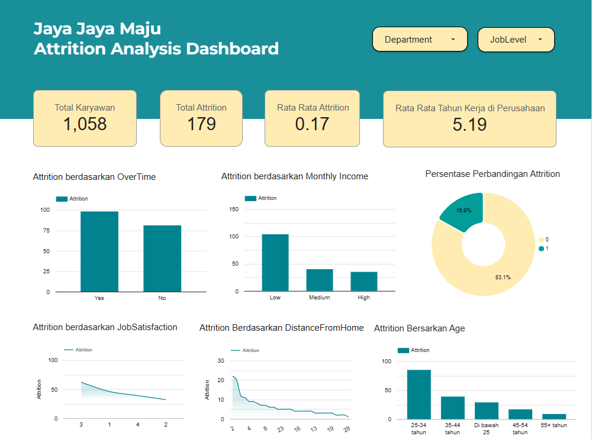

## Jaya Jaya Maju Human Resources Problems

```
.
├── datasets/
│   ├── employee_clean.csv
│   └── employee_data.csv
├── models/
│   ├── lr_model.pkl
│   └── rf_model.pkl
├── .gitignore
├── README.md
├── dashboard.png
├── notebook.ipynb
├── prediction.py
└── requirements.txt
```

### Business Understanding
**Jaya Jaya Maju** merupakan perusahaan multinasional yang telah berdiri sejak tahun 2000 dan memiliki lebih dari 1000 karyawan yang tersebar di seluruh negeri. Sebagai perusahaan besar yang telah beroperasi selama lebih dari dua dekade, perusahaan Jaya Jaya Maju telah berkembang secara signifikan. Namun, saat ini perusahaan Jaya Jaya Maju sedang menghadapi tantangan dalam mengelola sumber daya manusia, terutama terkait dengan **attrition rate** (Rasio jumlah karyawan keluar dengan total karyawan keseluruhan). Persentasi attrition rate yang melebihi dari 10% merupakan masalah serius yang dapat berdampak pada biaya operasional perusahaan seperti biaya rekruktmen dan pelatihan karyawan baru, serta potensi kehilangan karyawan berpengalaman yang dapat mempengaruhi stabilitas dan produktivitas perusahaan. Oleh karena itu, perusahaan memerlukan strategi efektif untuk menganalisis faktor-faktor yang menjadi penyebab tingginya persentase attrition rate. Manajer departemen HR berencana untuk memanfaatkan Data Science untuk mengidentifikasi faktor penyebab attrition dan membuat business dashboard untuk mempermudah perusahaan untuk menlakukan monitoring.

### Permasalahan Bisnis
Adapun beberapa permasalahan bisnis pada perusahaan Jaya Jaya Maju, antara lain :
1. Mengidentifikasi faktor utama yang paling berkontribusi terhadap meningkatnya attrition rate.
   
3. Membuat Business Dashboard untuk mempermudah HR dalam melakukan monitoring dan memberikan insight yang efektif untuk menangani permasalahan attrition rate.


### Cakupan Proyek
Untuk menjawab permasalahan bisnis dari perusahaan ini, perlu dilakukan analisis lebih lanjut. Proyek ini akan menerapkan machine learning teknik klasifikasi dan sebuah business dashboard untuk mempermudah identifikasi dan melakukan monitoring berbagai faktor yang menyebabkan tren meningkatnya persentase attrition.

Adapun tahapan analisis pada proyek ini, antara lain:
1.  **Data Preparation**
    Pada tahap ini akan dilakukan beberapa pengecekan mengenai dataset seperti pengecekan missing value, tipe data, dan variabel atribut target **Attrition**.

2.  **EDA (Exploratory Data Analysis)**
    Pada tahap ini, dataset akan divisualisasikan berdasarkan jenis data (kategorikal dan numerikal). Teknik EDA yang digunakan pada proyek ini yaitu **Univariate**, **Bivariate**, dan **Multivariate Analysis**.

3.  **Data Preprocessing**
    Pada tahap ini akan dilakukan pembersihan lebih lanjut seperti menghapus atribut yang tidak relevan, encoding, scaling, spliting data latih dan data uji.

4.  **Modelling**
    Tahap ini melibatkan pemilihan algoritma machine learning yang sesuai, pelatihan model menggunakan data yang telah diproses, dan hyperparameter tuning untuk mendapatkan performa yang optimal. Pada proyek ini algoritma yang digunakan adalah **Logistic Regression** dan Random **Forest** 

5.  **Evaluation**
    Pada tahap ini model machine learning yang sudah dilatih akan dievaluasi performanya dan menyimpan hasil model yang sudah diuji untuk digunakan pada model prediksi. Selain itu, pada tahap ini hasil dari model Random Forest akan digunakan untuk mengecek **Feature Importance** yang akan digunakan sebagai tolak ukur pembuatan dashboard analisis.
    
Persiapan 
Sumber data: Proyek ini akan menggunakan [Dataset Perusahaan Jaya Jaya Maju](https://github.com/dicodingacademy/dicoding_dataset/tree/main/employee) 

Setup environment: 
```
# Membuat virtual environment
python -m venv .env

# Mengaktifkan virtual environment
.env\Scripts\activate

# Menginstall depedensi yang dibutuhkan
pip install -r requirements.txt

# Menjalankan model prediksi
python prediction.py
```
### Business Dashboard
Business Dashboard disusun menggunakan **Looker Studio** yang berfungsi untuk mengidentifikasi faktor-faktor yang mempengaruhi **attrition rate** karyawan pada perushaan. Dashboard ini menyediakan visualisai yang komprehensif, sehingga dapat mempermudah HR dalam melakukan monitoring dan pengambilan keputusan untuk menyelesaikan serta mengurangi **attrition rate**.

Link : [Atrittion Analysis Dashboard](https://lookerstudio.google.com/reporting/e0c6f7b4-5174-4dc2-ab59-823c87440497)


Berikut adalah penjelasan fungsi dari Business Dashboard, antara lain:

- **Kontrol Global (Filter)**: Fitur ini berfungsi untuk memilah dan memfokuskan analisis karyawan berdasarkan departemen spesifik dan tingkat jabatan yang memuungkinkan HR untuk dapat menggali lebih dalam atau membandingkan kondisi antar segmen di seluruh dasbor.

- **Ringkasan Utama (Key Performance Indicator)**: Fitur ini berfungsi untuk menyajikan metrik-metrik kunci seperti total karyawan saat ini, persentase tingkat attrition, jumlah atrittion karyawan, dan rata-rata masa kerja karyawan attrition secara ringkas dan jelas.

- **Analisis Faktor Utama Attrition (Feature Importance Visualizations)**: Fitur ini berfungsi untuk menampilkan visualisasi data mengenai bagaimana faktor-faktor penting yang teridentifikasi dari model seperti **OverTime**, **MonthlyIncome**, **Age**, atau **DistanceFromHome** berhubungan secara signifikan dengan tingkat attrition karyawan. Hal ini dapat membantu HR memahami pemicu utama dan mengidentifikasi kelompok karyawan yang paling berisiko.

- **Diagram Spesifik**: Fitur ini berfungsi untuk menunjukkan komposisi atau distribusi proporsional attrition karyawan berdasarkan satu dimensi atau kategori tertentu seperti proporsi attrition karyawan dari tiap tingkat jabatan atau tiap departemen, sehingga HR dapat melihat kontribusi relatif setiap segmen terhadap angka atrisi keseluruhan.


### Conclusion
- **Penggunaan Algoritma**
Proyek ini menggunakan dua algoritma  (Logistic Regression dan Random Forest). LR digunakan untuk membangun model prediksi utama dengan akurasi 88,21% untuk memprediksi kemungkinan karyawan attrition. Sementara RF digunakan untuk analisis fitur-fitur yang berpengaruh terhadap attrition, yang hasilnya digunakan untuk pembuatan business dashboard guna mendukung pengambilan keputusan. 
  
- **Faktor-Faktor Utama Penyebab Attrition**
Berdasarkan analisis feature importance dari model Random Forest, faktor-faktor yang paling signifikan berkontribusi terhadap potensi attrition di perusahaan adalah **MonthlyIncome**, **OverTime**, **Age**, **TotalWorkingYears**, **EnvironmentSatisfaction**, dan **JobLevel**. Rendahnya pendapatan bulanan, tingginya frekuensi lembur, usia tertentu, total masa kerja, ketidakpuasan terhadap lingkungan kerja, serta level pekerjaan menjadi pendorong utama penyebab attrition.

- **Performa Model**
Evaluasi awal model Logistic Regression (LR) untuk prediksi attrition karyawan menunjukkan akurasi keseluruhan yang menjanjikan sebesar 88,21%, dengan kinerja solid dalam mengidentifikasi karyawan non-attrition . Meskipun model mencapai precision yang baik untuk prediksi karyawan berpotensi attrition , tantangan utama terletak pada recall (0,41) untuk kelas ini, yang utamanya disebabkan oleh ketidakseimbangan data. Oleh karena itu, saran untuk pengembangan selanjutnya adalah menerapkan teknik penanganan data tidak seimbang guna meningkatkan sensitivitas model terhadap kasus attrition, sehingga model utnuk deteksi attrition dapat lebih optimal dan akurat.

### Rekomendasi Action Items
Beriku beberapa rekomendasi yang dapat di implementasi oleh perusahaan guna menyelesaikan permasalahan attrition rate.

1. **Optimalisasi Struktur Kompensasi dan Kesejahteraan Finansial Karyawan**: Lakukan tinjauan komprehensif terhadap keseluruhan paket remunerasi, termasuk gaji pokok **(MonthlyIncome)** dan program insentif jangka panjang seperti opsi saham **(StockOptionLevel)**. Pastikan daya saingnya terhadap standar industri untuk peran serupa dan pertimbangkan penyesuaian yang ditargetkan untuk peran atau individu yang teridentifikasi berisiko tinggi dan underpaid, sambil terus memantau tingkat atrisi pada berbagai kelompok pendapatan dan level opsi saham melalui dashboard.

2. **Peningkatan Pengalaman, Keterlibatan, dan Keseimbangan Kehidupan Kerja Karyawan**: Selidiki secara mendalam akar penyebab tingginya permintaan lembur **(OverTime)** dengan mengevaluasi beban kerja, efisiensi proses, dan kebutuhan sumber daya. Secara proaktif, tingkatkan kualitas lingkungan kerja **(EnvironmentSatisfaction)** dan kepuasan kerja **(JobSatisfaction)** melalui survei berkala dan tindak lanjut konkret pada aspek fisik, non-fisik, budaya perusahaan, serta kualitas manajemen. Dashboard dapat dimanfaatkan untuk melacak atrisi di departemen atau peran dengan tingkat lembur tinggi dan memantau perubahan kepuasan.

3. **Penguatan Manajemen Siklus Hidup Talenta dan Pengembangan Karir**: Analisis kebutuhan spesifik karyawan berdasarkan kelompok usia **(Age)**, total masa kerja **(TotalWorkingYears)**, lama bekerja di perusahaan **(YearsAtCompany)**, dan tingkat jabatan **(JobLevel)**. Sediakan jalur karir yang jelas, program mentoring yang efektif, peluang pengembangan yang relevan, serta tantangan kerja yang memadai untuk setiap segmen. Fokuskan upaya pada program orientasi dan dukungan awal karir untuk karyawan baru, serta pastikan karyawan senior dan berpengalaman merasa dihargai dan memiliki ruang untuk terus berkembang.

